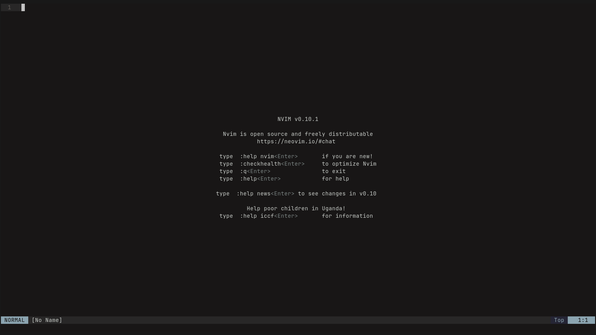
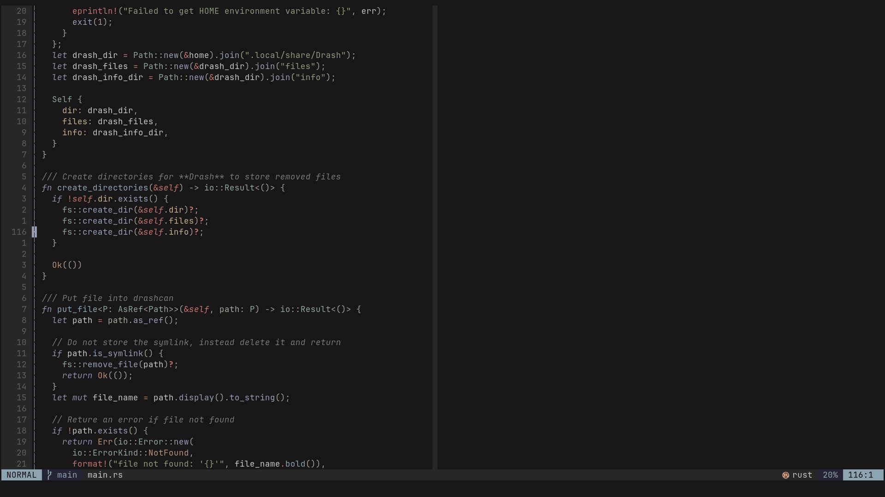
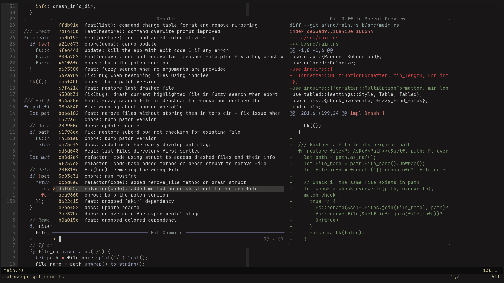
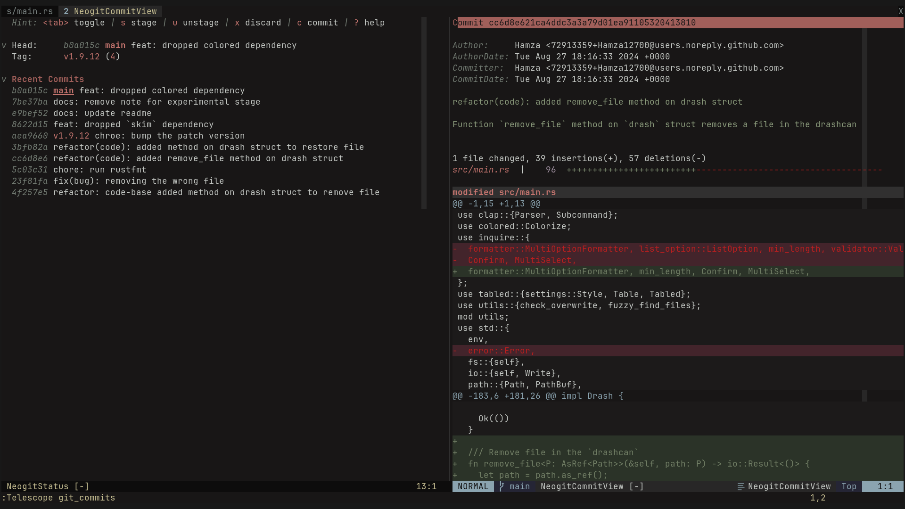

# Neovim (PDE)

<a href="https://dotfyle.com/Hamza12700/neovim"></a>
<a href="https://dotfyle.com/Hamza12700/neovim"></a>
<a href="https://dotfyle.com/Hamza12700/neovim"></a>

This repo contains all of my [neovim](https://neovim.io/) config files.

Huge shout-out to [TeejDries](https://github.com/TeejDries) for this awesome [nvim kickstart](https://github.com/nvim-lua/kickstart.nvim) guide. 

## Get Started

> [!NOTE]
> I use `neovim-nightly`, but the configuration should work with the stable version of neovim.

Make a backup of your current `neovim` config:

```bash
mv ~/.config/nvim/ ~/.config/nvim.bak
```

Optional but recommended:

```bash
rm ~/.local/share/nvim
rm ~/.local/state/nvim
rm ~/.cache/nvim
```

Clone the repository and open `nvim`:

```bash
git clone https://github.com/Hamza12700/Neovim.git ~/.config/nvim/ && nvim
```

## Preview





